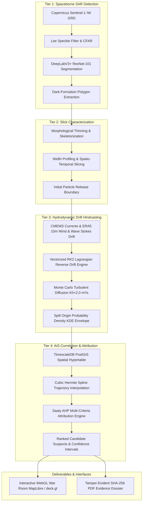

# AEGIS-Marine

**Autonomous Spaceborne SAR Oil Spill Detection, Hydrodynamic Drift Hindcasting & AIS Vessel Attribution Platform**

[](LICENSE)
[](https://www.python.org/)
[](https://fastapi.tiangolo.com/)
[](https://nextjs.org/)
[](https://www.timescale.com/)
[](https://www.docker.com/)

---

## Executive Summary

**AEGIS-Marine** is an enterprise-grade, court-defensible maritime intelligence platform designed to autonomously detect illicit oil discharges from Copernicus Sentinel-1 Synthetic Aperture Radar (SAR) imagery, simulate reverse hydrodynamic Lagrangian drift over oceanographic current and atmospheric wind fields, and correlate spatio-temporal vessel trajectories from terrestrial/satellite AIS to identify **candidate suspects** and calculate multi-criteria attribution scores.

Engineered to meet the legal standards of **MARPOL Annex I** investigations and international maritime judicial inquiries, AEGIS-Marine operates under strict constitutional rules guaranteeing zero black-box scoring, tamper-evident cryptographic hash stamping, and court-defensible terminology.

---

## 4-Tier Analytical Architecture



### 1. Tier 1: SAR Detection & Semantic Segmentation
- Ingests Sentinel-1 IW GRD C-band radar scenes via Copernicus Data Space Ecosystem (CDSE) with automatic offline fallback mode.
- Applies Lee Speckle Filtering ($7\times 7$ adaptive kernel), Constant False Alarm Rate (CFAR) edge detection, and a DeepLabV3+ (ResNet-101) neural network.
- Filters out natural biogenic films, meteorological wind shadows, and bathymetric anomalies using co-polarized VV/VH ratio thresholds.

### 2. Tier 2: Slick Slicing & Skeletonization
- Computes morphological skeletons via medial axis thinning.
- Profiles continuous slick widths from release head to weathering tail.
- Segments slick polygons into spatio-temporal slices representing differential discharge epochs.

### 3. Tier 3: Backward Lagrangian Drift Hindcasting
- Ingests multi-layer hydrodynamic forcing from Copernicus Marine Environment Monitoring Service (CMEMS) and ECMWF ERA5 10m wind fields.
- Vectorized Runge-Kutta 2nd Order (RK2 Midpoint) backward integration:
  $$\vec{x}(t - \Delta t) = \vec{x}(t) - \Delta t \cdot \vec{u}_{\text{composite}}\left(\vec{x}(t) - \frac{1}{2}\Delta t \vec{u}_{\text{composite}}(\vec{x}(t))\right) + \vec{\eta}_{\text{diffusion}}$$
- Accounts for Coriolis deflection ($+12.0^\circ$ deflection angle in Northern Hemisphere, $-12.0^\circ$ in Southern Hemisphere), wave Stokes drift, and Monte Carlo turbulent diffusion ($K_h = 2.0\text{ m}^2/\text{s}$).
- Derives 2D Gaussian Kernel Density Estimation (KDE) origin probability distribution envelopes (50%, 75%, 90%, 95% isocontours).

### 4. Tier 4: AIS Correlation & Attribution Scoring
- Spatio-temporal window queries over PostGIS TimescaleDB hypertables indexing millions of AIS Type 1, 2, and 3 position reports.
- Non-linear cubic Hermite spline interpolation reconstructing vessel positions between broadcast pings.
- Saaty Analytic Hierarchy Process (AHP) multi-criteria attribution model evaluating 5 discrete sub-scores:
  - $S_{\text{spatial}}$ (0.30): Geometric intersection with reverse particle dispersion cloud.
  - $S_{\text{temporal}}$ (0.25): Concurrency with estimated discharge time envelope.
  - $S_{\text{kinematic}}$ (0.15): Consistency of vessel speed with illicit discharge operational profiles (6–14 knots).
  - $S_{\text{anomaly}}$ (0.20): Deviation from established navigation corridors, course zig-zags, and AIS transmission dark periods.
  - $S_{\text{prior}}$ (0.10): MARPOL vessel type risk weightings (crude oil tanker, chemical carrier, container, bulk).
- Mathematically verified AHP Consistency Ratio $CR = 0.016 < 0.10$.

---

## Constitutional Governance Rules

AEGIS-Marine strictly enforces the 7 Non-Negotiable Constitutional Rules codified in [`rules.md`](rules.md):

1. **Rule 1 — Confidence Interval Requirement:** Attribution scores ($S_{\text{culprit}}$) and component metrics must be reported with explicit confidence intervals in $[0, 100]\%$. Naked scalar point estimates are forbidden.
2. **Rule 2 — Multi-Factor Attribution Transparency:** Every attribution evaluation must persist and present all 5 discrete sub-scores ($S_{\text{spatial}}$, $S_{\text{temporal}}$, $S_{\text{kinematic}}$, $S_{\text{anomaly}}$, $S_{\text{prior}}$). Monolithic aggregate scores are rejected.
3. **Rule 3 — Anti-Proximity Bias Enforcement:** Proximity alone does not constitute attribution. A vessel nearest to the slick in Euclidean distance cannot be attributed if temporal alignment, kinematic plausibility, or drift physics fail consistency checks.
4. **Rule 4 — Data Lineage & Cryptographic Hashing:** All analytical artifacts, raw radar scenes, simulation trajectories, and generated evidence dossiers must generate and persist SHA-256 digests.
5. **Rule 5 — Fallback & Offline Operation:** When external Copernicus, CMEMS, or AIS APIs are unavailable, the platform must seamlessly fall back to local synthetic test fixtures or cached historical data with degraded-mode watermarks.
6. **Rule 6 — Court-Defensible Phrasing:** The platform never declares legal determinations, civil fault, or criminal liability. Non-probabilistic determination language is strictly prohibited and blocked by CI linting. Permitted phrasing: **candidate suspect**, **potential source**, **most correlated vessel**, **statistically correlated**.
7. **Rule 7 — Zero-Discrepancy Schema Synchronization:** All OpenAPI contracts, Pydantic schemas, SQLAlchemy database models, and TypeScript frontend interfaces are kept 100% synchronized via automated codegen.

---

## Tech Stack Overview

| Subsystem | Technologies | Purpose |
|:---|:---|:---|
| **Backend API** | Python 3.12, FastAPI, Pydantic v2 | High-throughput asynchronous REST API & OpenAPI 3.1 generation |
| **Data & Storage** | PostgreSQL 16, PostGIS 3.4, TimescaleDB | Spatio-temporal hypertables for AIS trajectories & geographic polygons |
| **Object Store** | MinIO (S3-compatible) | Storage for SAR GeoTIFFs, particle trajectory arrays, and PDF dossiers |
| **Task Queue** | Celery 5.4, Redis 7.2 | Dedicated queues (`queue_tier1` to `queue_tier4`) with dead-letter handling |
| **Physics & Math** | NumPy, SciPy, xarray, NetCDF4, Shapely | Vectorized RK2 numerical integration, Monte Carlo diffusion, spline interpolation |
| **Dossier Engine** | WeasyPrint, PyMuPDF, Jinja2, Pillow | Court-ready PDF/A compilation with cryptographic SHA-256 seal & QR code |
| **Frontend UI** | Next.js 15 App Router, React 19, TypeScript | Reactive multi-pane War Room dashboard with standalone container output |
| **Map & Visuals** | MapLibre GL, deck.gl WebGL | 60 FPS hardware-accelerated rendering of 10,000+ particles & AIS tracks |
| **Styling & Icons**| Tailwind CSS, Lucide React, Radix UI | Accessible, dark-mode-first tactical maritime operations UI |

---

## Quickstart & Deployment Runbook

### Prerequisites
- Docker Engine 24.0+ and Docker Compose v2.20+
- Host RAM: Minimum 8 GB (16 GB recommended for high-particle simulations)
- Available Ports: `3000` (Frontend), `8000` (API), `5432` (TimescaleDB), `6379` (Redis), `9000`/`9001` (MinIO)

### Production Deployment (Single-Command)

Deploy the entire production multi-stage containerized stack using the automated deployment script:

```bash
# 1. Clone repository
git clone https://github.com/RhythmLovesTea/AEGIS_ENGINE.git
cd AEGIS_ENGINE

# 2. Configure environment
cp .env.example .env

# 3. Launch production stack with health-gated sequencing
bash scripts/deploy_local.sh
```

Or deploy directly via Docker Compose:

```bash
docker compose -f docker-compose.prod.yml up -d --build
```

### Service Health Verification

Check container statuses and health probes:

```bash
docker compose -f docker-compose.prod.yml ps
```

All 6 core services will report `(healthy)`:
- `aegis-db` (TimescaleDB / PostGIS): `pg_isready`
- `aegis-redis` (Celery Broker / PubSub): `redis-cli ping`
- `aegis-minio` (S3 Object Store): `mc ready local`
- `aegis-api` (FastAPI REST Backend): `curl -f http://localhost:8000/health`
- `aegis-worker` (Celery Multi-Queue Worker): Celery inspect ping
- `aegis-frontend` (Next.js Standalone UI): Node HTTP healthcheck

Access the interfaces:
- **War Room Dashboard:** [http://localhost:3000](http://localhost:3000)
- **FastAPI Interactive Docs:** [http://localhost:8000/docs](http://localhost:8000/docs)
- **MinIO Storage Console:** [http://localhost:9001](http://localhost:9001)

---

## Local Development Runbook

For developers working directly on the codebase:

### 1. Backend Setup
```bash
# Create and activate virtual environment
python3 -m venv .venv
source .venv/bin/activate

# Install dependencies
pip install -r backend/requirements.txt
pip install pytest pytest-asyncio httpx

# Start backing services (DB, Redis, MinIO)
docker compose -f docker-compose.prod.yml up -d db redis minio

# Run database migrations
alembic upgrade head

# Start FastAPI API server
uvicorn backend.app.main:app --host 0.0.0.0 --port 8000 --reload

# Start Celery worker in another terminal
celery -A backend.app.workers.celery_app worker -l info -Q queue_tier1,queue_tier2,queue_tier3,queue_tier4,queue_default
```

### 2. Frontend Setup
```bash
cd frontend
npm install
npm run dev
```

### 3. Synchronizing API Schemas & TypeScript Contracts
When backend Pydantic schemas or routes change, regenerate TypeScript interfaces:

```bash
bash scripts/generate_types.sh
```

---

## Verification & Compliance Testing

### Run Banned Terms Linter (Rule 6)
Ensures zero occurrences of non-compliant legal determination terminology across Python, TypeScript, templates, and configurations:

```bash
python3 scripts/lint_banned_terms.py
```

### Run Scientific Validation Benchmarks
Verifies physical consistency, Liu-Weisberg drift skill score ($ss \ge 0.80$), and AHP attribution accuracy:

```bash
python3 scripts/run_validation_benchmarks.py
```

### Run Unit & Integration Test Suites
```bash
# Unit test suite
pytest tests/unit -v

# Governance and synchronization tests
pytest tests/unit/test_governance_and_sync.py -v

# Full suite
pytest
```

---

## Architecture Decision Records (ADR)

All foundational architectural decisions and technology stack selections are formally documented in [`ADR.md`](ADR.md):

- **[ADR-001](ADR.md#adr-001-example--adopting-this-adr-process-itself):** Adoption of Version-Controlled ADR Documentation Process
- **[ADR-002](ADR.md#adr-002-timescaledb-hypertables-with-postgis-for-high-density-ais-spatio-temporal-ingestion):** TimescaleDB Hypertables with PostGIS for High-Density AIS Spatio-Temporal Ingestion
- **[ADR-003](ADR.md#adr-003-multi-queue-celery-architecture-with-dedicated-queue-isolation):** Multi-Queue Celery Architecture with Dedicated Queue Isolation
- **[ADR-004](ADR.md#adr-004-vectorized-runge-kutta-2nd-order-lagrangian-drift-simulation-with-monte-carlo-turbulent-diffusion):** Vectorized Runge-Kutta 2nd Order Lagrangian Drift Simulation with Monte Carlo Turbulent Diffusion
- **[ADR-005](ADR.md#adr-005-saaty-analytic-hierarchy-process-ahp-multi-criteria-attribution-scoring-engine):** Saaty Analytic Hierarchy Process (AHP) Multi-Criteria Attribution Scoring Engine
- **[ADR-006](ADR.md#adr-006-webgl-deckgl--maplibre-gl-visualization-architecture-with-nextjs-standalone-build):** WebGL deck.gl & MapLibre GL Visualization Architecture with Next.js Standalone Build
- **[ADR-007](ADR.md#adr-007-cryptographic-sha-256-stamped-legal-evidence-dossier-generation-via-weasyprint--jinja2):** Cryptographic SHA-256 Stamped Legal Evidence Dossier Generation via WeasyPrint & Jinja2
- **[ADR-008](ADR.md#adr-008-multi-stage-production-containerization-and-health-gated-deployment-architecture):** Multi-Stage Production Containerization and Health-Gated Deployment Architecture

---

## Legal & Scientific Disclaimer

Attribution probabilities, trajectory hindcasts, and candidate rankings generated by AEGIS-Marine are **probabilistic decision-support intelligence**. Outputs do not constitute final judicial findings of legal liability. All evidentiary dossiers are compiled with strict chain-of-custody cryptographic seals intended for submission to competent maritime judicial authorities, coastal state administrations, and the International Maritime Organization (IMO).
